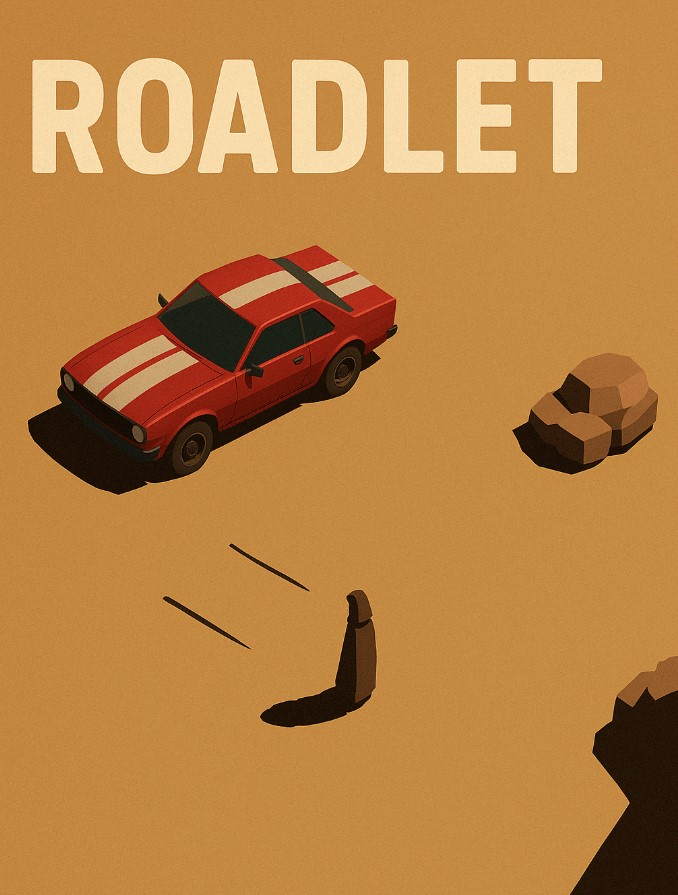

## Description
Roadlet is an exciting driving game where players embark on a thrilling journey across America. Experience the diverse landscapes and challenges as you navigate through various terrains and weather conditions.

## Planned Gameplay Mechanics
- **Open World Exploration**: Drive through a vast open world with realistic environments.
- **Dynamic Weather System**: Encounter different weather conditions that affect driving.
- **Vehicle Customization**: Customize your vehicle with various upgrades and accessories.
- **Challenges and Missions**: Complete various challenges and missions to progress.

## Controls
- **W**: Accelerate
- **S**: Brake/Reverse
- **A**: Steer Left
- **D**: Steer Right
- **Space**: Handbrake
- **Esc**: Pause Menu

## Additional Information
- **Credits**: Developed by Connor Simpson.
- **Known Issues**: [List any known issues or bugs].
- **Future Updates**: [Mention any planned updates or features].